```
Nama   : Aldi Alfariz
NIM    : 24552011212
Kelas  : TIF RP-23 CNS A
```

## link : [link website](https://codemaster.my.id/)

### login admin <br>
username: atmin <br>
password: atmin123
# Project Documentation

Berikut adalah dokumentasi tampilan aplikasi yang mencakup admin panel, player interface, dan halaman publik.

---
## 🎬 Video

**video gameplay**
[player.webm](https://github.com/user-attachments/assets/7af8b5a7-b2c2-4490-9c56-b050333b51f6)

## 📌 Screenshots

### 1. Admin Panel

- **Add Bulk Lesson**
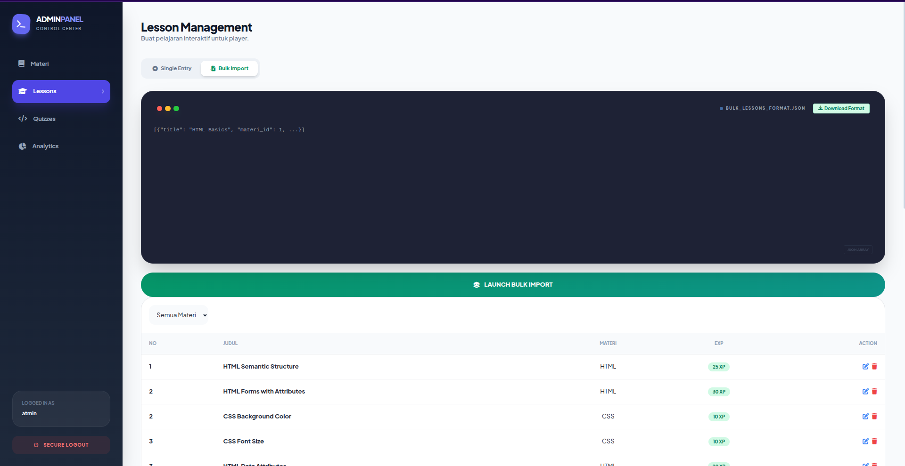  
Menambahkan beberapa pelajaran sekaligus di panel admin.

- **Add Bulk Quiz**
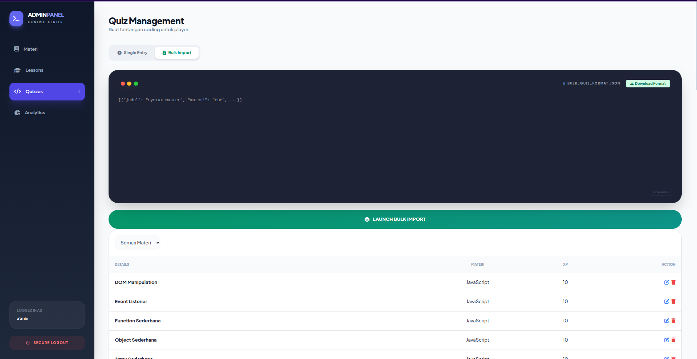  
Menambahkan beberapa kuis sekaligus di panel admin.

- **Add Lesson**
  
Menambahkan pelajaran tunggal melalui panel admin.

- **Add Materi**
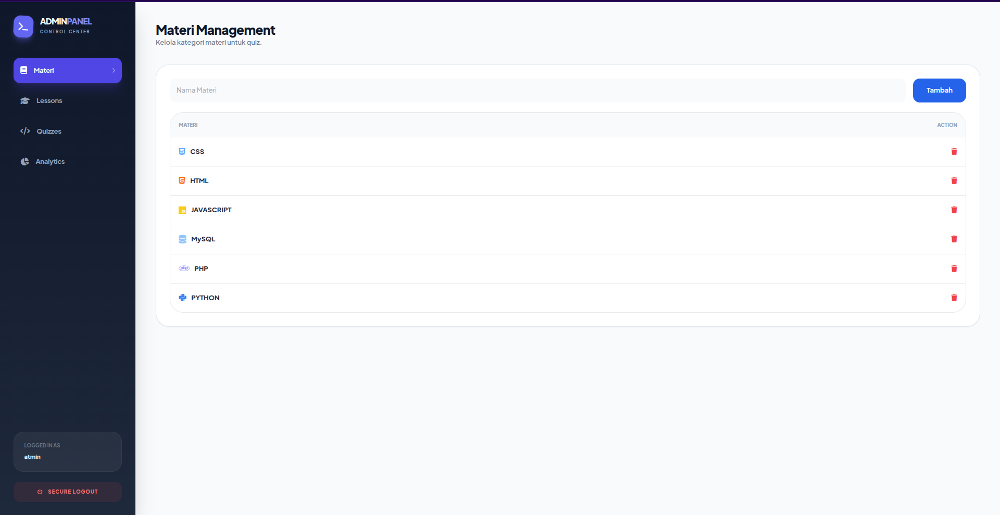  
Menambahkan materi pelajaran di panel admin.

- **Add Quiz**
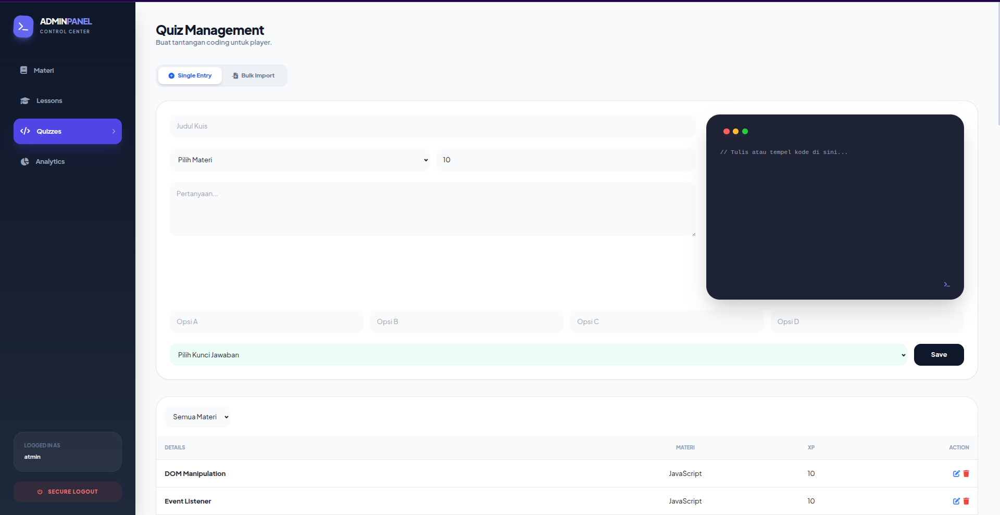  
Menambahkan kuis tunggal di panel admin.

- **Player Data**
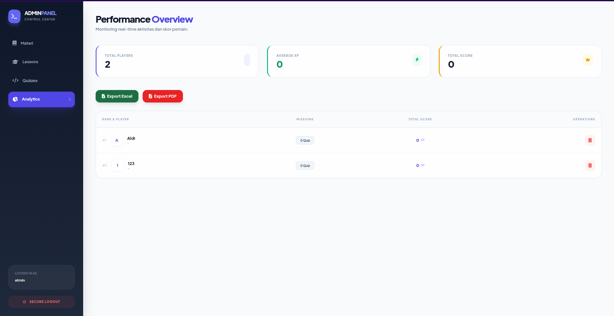  
Melihat data pemain dari sisi admin.

---

### 2. Player Interface

- **Dashboard Player**
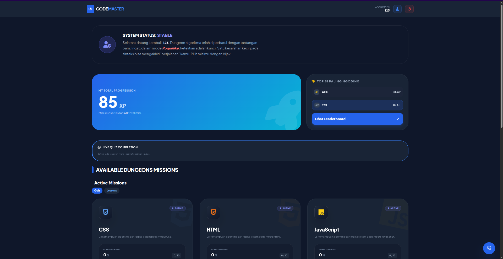  
Tampilan dashboard utama untuk pemain.

- **Lesson Game Page**
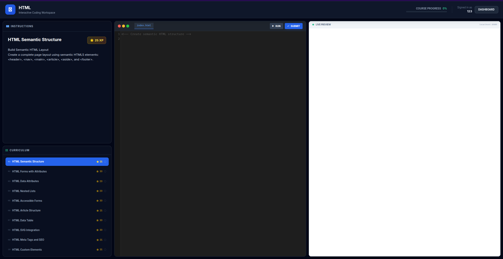  
Halaman permainan pelajaran yang interaktif untuk pemain.

- **Quiz Game Page**
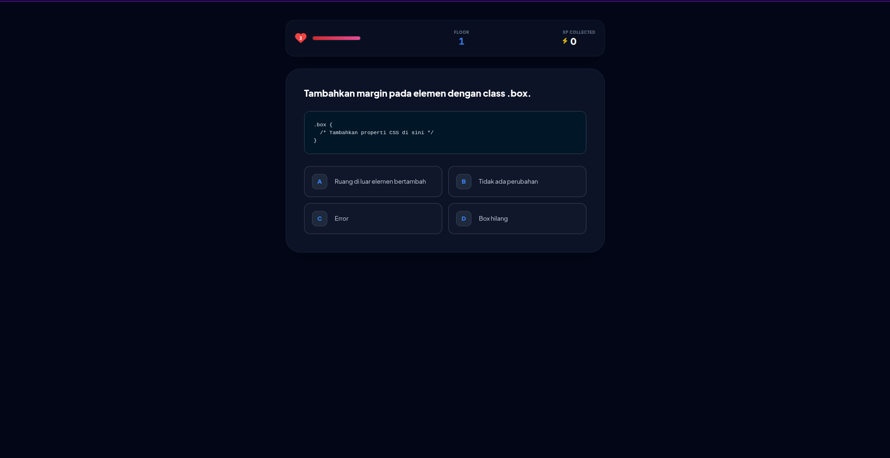  
Halaman permainan kuis untuk pemain.

- **Profile Page**
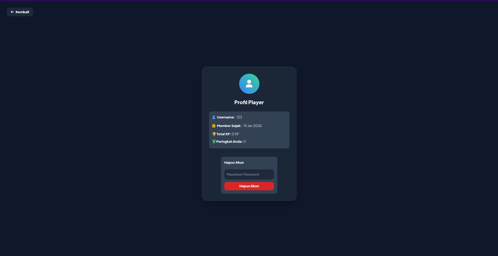  
Halaman profil pemain, termasuk statistik dan informasi akun.

- **Leaderboard Page**
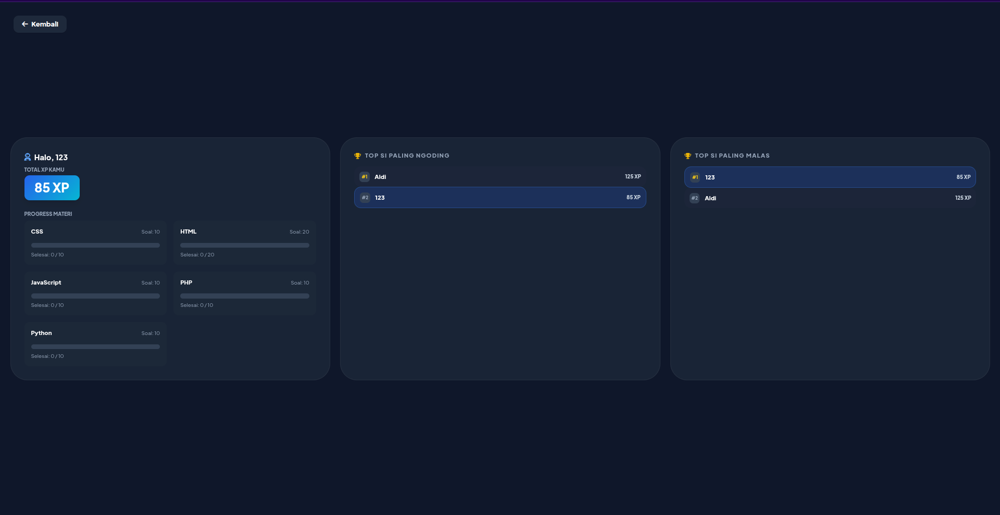  
Halaman papan peringkat yang menampilkan skor pemain terbaik.

---

### 3. Public Pages

- **Landing Page**
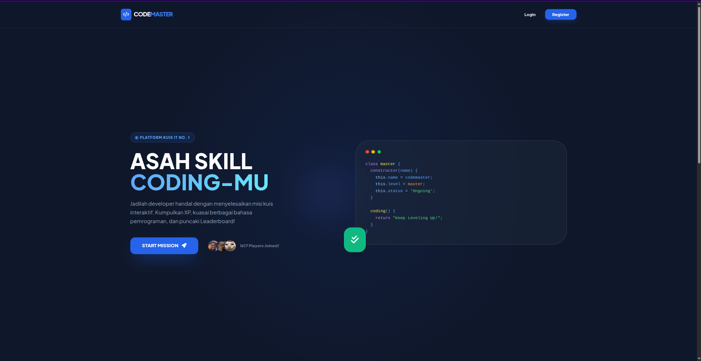  
Halaman utama aplikasi untuk pengunjung.

- **Landing Page Bottom**
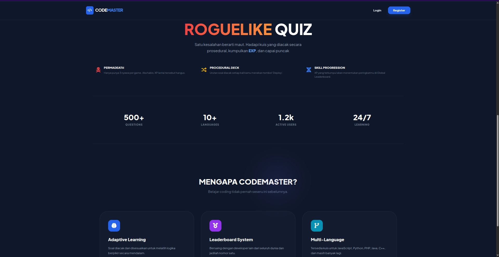  
Bagian bawah halaman utama dengan informasi tambahan atau footer.

- **Login**
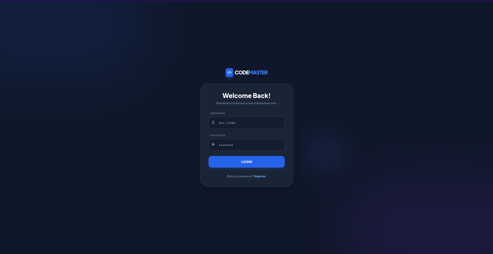  
Halaman login untuk masuk ke aplikasi.

- **Registrasi**
  
Halaman registrasi untuk membuat akun baru.

---

### 4. Cookie
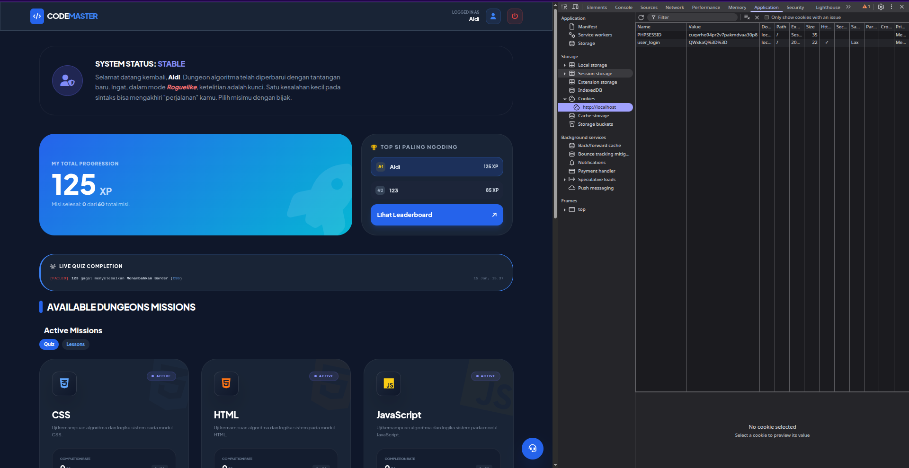

## ⚡ Keterangan

- Semua gambar berada di folder: `assets/img/screenshot/`
